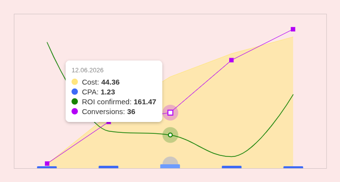

# Chart

A compact four-series time chart built with [Highcharts](https://www.highcharts.com/).
Each of the four fixed slots is drawn with a different display type — `area`,
`spline`, `line` and `bar` — over a shared time axis, matching the reference in
`docs/reference/`.



## Getting started

```bash
npm i
npm run dev
```

Then open the printed URL to see the demo (`index.html` + `src/main.ts`).

## Usage

```ts
import { createChart, type Slot } from "./src/chart";

const point = (ts: number, v: number): [number, number] => [ts, v];

createChart(document.getElementById("chart")!, {
  area:   { name: "Cost",          data: [point(Date.UTC(2026, 5, 10), 2.04), /* … */] },
  spline: { name: "ROI confirmed", data: [point(Date.UTC(2026, 5, 10), 610.78), /* … */] },
  line:   { name: "Conversions",   decimals: 0, data: [point(Date.UTC(2026, 5, 10), 3), /* … */] },
  bar:    { name: "CPA",           data: [point(Date.UTC(2026, 5, 10), 0.68), /* … */] },
});
```

`createChart` returns the live `Highcharts.Chart`, so use its native `update` /
`destroy` methods directly. The pure `buildOptions(input)` is exported too, if you
only need the options object.

### `Slot`

```ts
type Slot = {
  name: string;              // series name, shown in the shared tooltip
  color?: string;            // overrides the reference color for the slot
  decimals?: number;         // tooltip precision, defaults to 2
  data: [number, number][];  // [timestampMs, value] pairs
};
```

Each slot gets its own hidden vertical scale (**independent scale**), so series
heights are not comparable to each other. The **shared tooltip** lists every
series that has a point at the hovered moment.

## Scripts

```bash
npm run dev        # start Vite dev server
npm run build      # type-check and bundle
npm run typecheck  # tsc --noEmit
npm test           # run vitest
```

## Project layout

- `src/chart.ts` — `createChart` / `buildOptions`, the whole chart
- `src/main.ts`, `index.html` — demo with the reference data
- `docs/reference/` — frames from the reference screencast
- `CONTEXT.md`, `docs/adr/` — glossary and design decisions

The chart was built by AI coding agents from GitHub issues: `.sandcastle/` is the
agent harness (`npm run sandcastle`), `docs/agents/` and `CLAUDE.md` are their
instructions. None of it is needed to run the chart.
